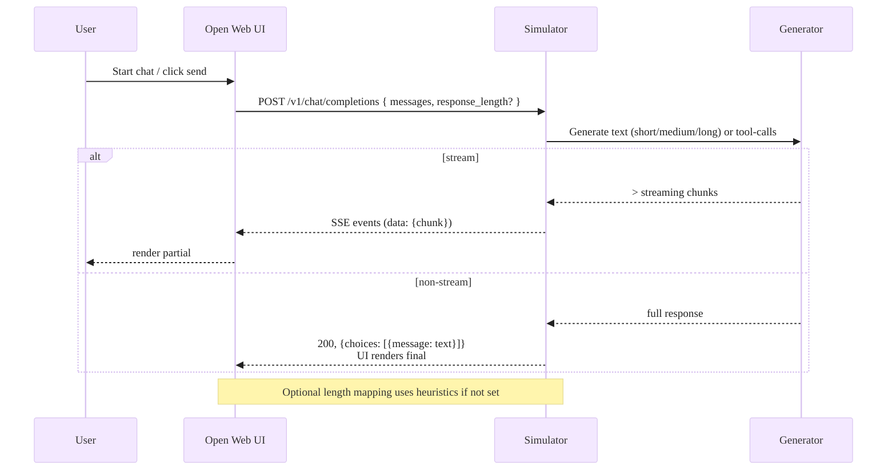
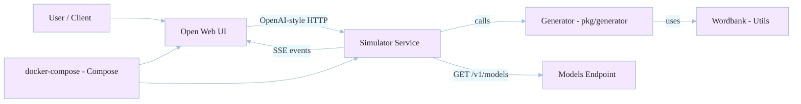

# OpenAI API Simulator

This is a compact, dependency-free OpenAI-compatible Chat Completion simulator written in Go. It exposes a minimal, predictable subset of OpenAI Chat Completion features so you can test UIs, integrate tool-calling flows, or build deterministic CI tests without calling a paid service.

)

Why this repo is helpful

- Lightweight single-binary service for local development
- OpenAI-style endpoints for chat completions and models
- SSE streaming with OpenAI-compatible `data: <json>` framing
- Structured JSON schema generation and basic tool-call simulation
- Deterministic seeding and heuristics for reproducible tests

## Running

Quick start (recommended):

1. Build the server and run it on port 3080:

```bash
make build
make run PORT=3080
```

1. Or run directly with go build:

```bash
go build ./cmd/server
./server -port 3080
```

This will start an HTTP server with the route: `POST /v1/chat/completions`.

Additional useful endpoints

- `GET /` - basic status -> {"service":"openai-api-simulator","status":"ok"}
- `GET /health` - liveness/readiness -> {"ok":true}
- `GET /v1/models` and `GET /models` - model listing
- `POST /v1/chat/completions` and `POST /chat/completions` - chat completions (streaming or non-streaming)

Command-line stream configuration

You can set default streaming latency and token throttles when starting the server. These defaults apply when the client does not include `stream_options` in the request.

Example flags:

```bash
./server -port 3080 -stream_delay_min_ms 50 -stream_delay_max_ms 200 -stream_tokens_per_second 30
```

This starts the simulator with 50–200ms jitter per chunk and aims to emit tokens at ~30 tokens/sec.

### Docker

Build and run using Docker (the container exposes port 3080):

```bash
make docker-build
make docker-run PORT=3080
```

Or use compose:

```bash
make compose-up
# later
make compose-down

```

Open Web UI (optional):

The included `docker-compose.yml` also adds an optional `openwebui` service (Open Web UI) configured to route OpenAI-style API requests to the simulator. You can run the full stack with:

```bash
make compose-up
```

After the compose stack starts, Open Web UI will be available at <http://localhost:3000> and will send OpenAI-compatible API calls to the simulator service at `http://simulator:3080`.

The Open Web UI container uses the environment variable `OPENAI_API_BASE_URL` to route OpenAI API calls. `docker-compose.yml` sets this to the `simulator` service. If you run Open Web UI separately, you can set the env var like this:

```bash
docker run -d -p 3000:8080 -e OPENAI_API_BASE_URL=http://host.docker.internal:3080 \
  -e OPENAI_API_KEY=simulator -v open-webui:/app/backend/data ghcr.io/open-webui/open-webui:main
```

Notes:

- `OPENAI_API_KEY` is required by Open Web UI when calling an OpenAI-compatible API, but the simulator currently does not enforce API keys; you can use any token.
- `WEBUI_AUTH=False` is set in the compose file so you don't need to sign in for local testing; remove it for multi-user setups.

Troubleshooting Open Web UI errors (500/No models)

- If Open Web UI shows a 500 page or no models are visible, follow these steps:
  1. Check the UI logs: `docker compose logs openwebui` — Open Web UI will report HTTP errors it receives from the backend.
  2. Confirm the simulator is reachable from inside the `openwebui` container: `docker compose exec openwebui curl -sS http://simulator:3080/v1/models`.
  3. If you see a 404 calling `/models`, note this repo exposes both `/v1/models` and legacy `/models` to maximize compatibility.
  4. Tail the simulator logs to see request traces (we log method/path): `docker compose logs simulator`
  5. If the UI still fails with `Not authenticated`, check the `OPENAI_API_KEY` and the UI config — the simulator does not validate tokens, but Open Web UI still sends the header.

### Makefile

This repo ships a convenient `Makefile` with ergonomic commands; run `make help` to see available commands and examples. Highlights:

- `make compose-up` — start the full compose stack including the `openwebui` service.
- `make compose-openwebui` — start only the Open WebUI service via compose (simulator will start as dependency if needed).
- `make compose-logs` — tail compose logs for debugging.
- `make docker-run-openwebui` — run the Open WebUI container and point it at your host `simulator` (convenient if you don't want to use compose).

## Example Requests

Streaming examples (SSE):

Stream a completion with SSE (shell-friendly):

```bash
curl -N -X POST http://localhost:3080/v1/chat/completions \
  -H "Content-Type: application/json" \
  -d '{"model":"gpt-sim-1","messages":[{"role":"user","content":"Hello"}],"stream":true}'
```

Streaming notes

- The simulator emits `data: <json>\n\n` events where each event's payload is a valid OpenAI-style chunk.
- Each event is JSON and finishes with `data: [DONE]` to indicate the stream end.
- Use `curl -N` to keep the connection open and see events as they arrive.

Latency & throttling

- You can configure streaming latency (jitter) and a token-rate throttle by
  setting `stream_options` in the request body. This allows you to emulate
  both network/computation jitter and model throughput.

  Example fields supported in `stream_options`:
  - `delay_min_ms` / `delay_max_ms` — randomized per-chunk jitter in millis
  - `tokens_per_second` — throttle rate for token emission (float)

  Example:

```json
{"model":"gpt-sim-1","messages":[{"role":"user","content":"Hi"}],"stream":true,
 "stream_options":{"delay_min_ms":50,"delay_max_ms":200,"tokens_per_second":30}}
```

This will inject a random delay between 50–200ms per chunk and attempt to
emit tokens at roughly 30 tokens/sec which makes slow or bursty LLMs easier
to test against.

Non-streaming JSON completion:
Structured JSON response example (response_format: json_schema):

```bash
curl -X POST http://localhost:3080/v1/chat/completions \
  -H "Content-Type: application/json" \
  -d '{"model":"gpt-sim-1","messages":[{"role":"user","content":"Give me a Person JSON"}],"response_format":{"type":"json_schema","json_schema":{"type":"object","properties":{"name":{"type":"string"},"age":{"type":"integer"},"email":{"type":"string","format":"email"}},"required":["name","email"]}}}'
```

The simulator will generate a plausible JSON object honoring required fields. (MVP-level -- see ADR for future enhancements like stricter schema validation.)
You can also control the approximate length of the generated text with the optional `response_length` field. Supported values: `short`, `medium`, `long`.

If you omit `response_length`, the simulator will pick a short/medium/long answer probabilistically based on the length of your prompt (short prompts -> shorter outputs, long prompts -> longer outputs, with some randomness).

Length semantics and behavior

- `short` — typically 30–140 characters (useful for short replies, quick suggestions)
- `medium` — typically 120–360 characters (the default)
- `long` — typically 360–1200 characters (paragraphs and detailed responses)

If you omit `response_length` the server uses `MapResponseLengthToRangeForMessages` to make an informed random choice based on the average length of your supplied messages. This makes end-to-end UI tests more realistic — short prompts get short replies, longer prompts get more verbose responses, and there is a random component for variation.

If you want reproducible output during tests, set the `seed` field in the request body (see `pkg/models/models.go`).
Features

- SSE streaming that mirrors OpenAI's `data: <json>\n\n` format and `[DONE]` sentinel
- Structured output generation for `response_format: { type: "json_schema" }`
- Tool call generation (random/contextual/sequence strategies)
- Deterministic mode with seeding for reproducible tests (when provided by generator)
- Lightweight, single-binary local server with no external service dependencies


```bash
curl -X POST http://localhost:3080/v1/chat/completions \
  -H "Content-Type: application/json" \
  -d '{"model":"gpt-sim-1","messages":[{"role":"user","content":"Hello"}],"stream":false}'
```

## Tests

Testing and development tasks:

Run unit and integration tests:

Run the test suite:

```bash
make test
```

Lint, format & tidy:

```bash
make fmt
make tidy
```

Developer notes

- Where generation happens: `pkg/generator/text_generator.go` — this builds sentence templates with a word bank and now supports multi-paragraph outputs.
- Response length mapping: `pkg/streaming/handler.go` exports `MapResponseLengthToRange` and `MapResponseLengthToRangeForMessages`; these pick short/medium/long ranges and introduce randomness based on the input.
- The HTTP router is in `pkg/server/server.go`. It intentionally registers both `/v1/models` and `/models` to support UIs that expect legacy endpoints.

Contribution guide

- Add tests to `pkg/generator` for any new text shapes.
- For API changes, update both `pkg/models/models.go` and the wrappers in `pkg/server` and `pkg/streaming`.
- Before opening a PR run `make test` — the project includes integration tests that spin up an in-memory server.
- Keep the generator deterministic where tests expect predictable outputs by using `seed` and `NewCoherentTextGeneratorWithSeed`.

## Diagrams


Architecture (quick overview):

Sequence: request & response flow (short):



Tip: if your editor or docs site renders Mermaid, these diagrams will show the pastel colors; otherwise they remain readable as plain text in the raw README.

### Architecture Diagram

High-level component view:


