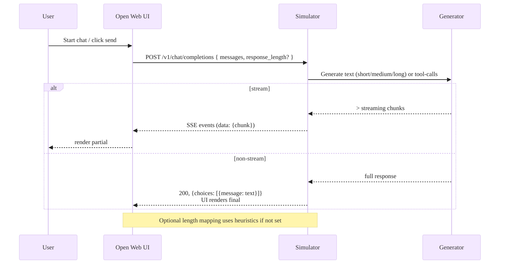
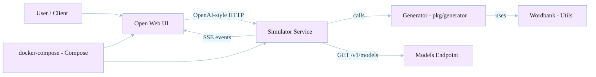

# OpenAI API Simulator

This is a compact, dependency-free OpenAI-compatible Chat Completion simulator written in Go. It exposes a minimal, predictable subset of OpenAI Chat Completion features so you can test UIs, integrate tool-calling flows, or build deterministic CI tests without calling a paid service.


Why this repo is helpful

- Lightweight single-binary service for local development
- OpenAI-style endpoints for chat completions and models
- SSE streaming with OpenAI-compatible `data: <json>` framing
- Structured JSON schema generation and basic tool-call simulation
- Deterministic seeding and heuristics for reproducible tests
- **NEW: Real AI inference with SmolLM (135M parameter model)**

## 🚀 SmolLM - Real AI in One Command

Run a **real 135M parameter AI model** with a single command:

```bash
make run-smollm
```

Or build and run:

```bash
make build-smollm
./openai-api-simulator-smollm
```

This will:
- ✅ Auto-detect your platform (macOS/Linux, Intel/ARM)
- ✅ Download llama.cpp server (~50MB) and SmolLM model (~269MB) on first run
- ✅ Cache everything for instant subsequent starts (~2 seconds)
- ✅ Start an OpenAI-compatible API server on port 8090
- ✅ Provide both fake (`gpt-sim-1`) and real (`smollm`) models

**First run:** ~45 seconds (downloads everything)  
**Subsequent runs:** ~2 seconds (uses cache)

Test the real AI model:

```bash
curl http://localhost:3080/v1/chat/completions \
  -d '{"model":"smollm","messages":[{"role":"user","content":"Why is the sky blue?"}]}'
```

### Available Models

When running with SmolLM:
- `gpt-sim-1` - Original deterministic fake model (for testing)
- `smollm` - Real 135M parameter model by HuggingFace (SmolLM-135M)

## Running (Simulator Mode)

Quick start (recommended):

1. Build the server and run it on port 8090:

```bash
make build
make run PORT=8090
```

1. Or run directly with go build:

```bash
go build ./cmd/server
./server -port 8090
```

This will start an HTTP server with the route: `POST /v1/chat/completions`.

Additional useful endpoints

- `GET /` - basic status -> {"service":"openai-api-simulator","status":"ok"}
- `GET /health` - liveness/readiness -> {"ok":true}
- `GET /v1/models` and `GET /models` - model listing
- `POST /v1/chat/completions` and `POST /chat/completions` - chat completions (streaming or non-streaming)

Command-line stream configuration

You can set default streaming latency and token throttles when starting the server. These defaults apply when the client does not include `stream_options` in the request.

Example flags:

```bash
./server -port 8090 -stream_delay_min_ms 50 -stream_delay_max_ms 200 -stream_tokens_per_second 30
```

This starts the simulator with 50–200ms jitter per chunk and aims to emit tokens at ~30 tokens/sec.

### Docker

Build and run using Docker (the container exposes port 8090):

```bash
make docker-build
make docker-run PORT=8090
```

## 🐳 Docker Compose Deployment Modes

Choose one of two deployment modes depending on your needs:

### Mode 1: Pure Simulation (No AI Model)

**Best for:** Quick testing, CI/CD pipelines, lightweight deployments, instant responses

```bash
make compose-up-noai
```

This starts:

- **API Simulator** on `http://localhost:8090` — responds instantly with fake AI
- **Open Web UI** on `http://localhost:3000` — web interface for chat

**What's included:**

- No Python dependencies
- No model downloads
- Instant startup (~2 seconds)
- Deterministic responses for testing

**Test it:**

```bash
make curl-sim  # Test pure simulation API
make curl-stream  # Test SmolLM streaming
make curl-text  # Test SmolLM non-streaming

**Stop it:**

```bash
make compose-down-noai
```

### Mode 2: Full Stack with SmolLM (Real AI Model)

**Best for:** Production testing, realistic inference, benchmarking, real AI responses

```bash
make compose-up
```

This starts:

- **API Simulator** on `http://localhost:8090` — with SmolLM inference
- **SmolLM Inference Server** on `http://localhost:8081` — PyTorch model
- **Open Web UI** on `http://localhost:3000` — web interface for chat

**What's included:**

- Real 135M parameter AI model (SmolLM) — **baked into the image by default**
- Python runtime with PyTorch
- Realistic inference latency

**Startup time:** ~5 seconds (model is pre-baked in the image)  
**First build:** ~3-5 minutes (builds image with embedded model, one-time only)  
**Subsequent runs:** ~5 seconds (uses cached baked image)

**If you prefer a smaller image without the baked model:**

```bash
BAKED=false make compose-up
# First run downloads model (~269MB) at startup (~45 seconds)
# Subsequent runs: ~5 seconds (uses downloaded cache)
```

**Test it:**

```bash
make open  # Opens Web UI in browser
# Or test with the real model:
curl http://localhost:8090/v1/chat/completions \
  -H "Content-Type: application/json" \
  -d '{"model":"smollm","messages":[{"role":"user","content":"Explain AI briefly"}],"stream":true}'
```

**Stop it:**

```bash
make compose-down
```

---

### Comparison Table

| Feature | Pure Simulation | With SmolLM |
|---------|-----------------|----------------------|
| **Startup Time** | ~2 seconds | ~45s (first run), ~5s (cached) |
| **Model Downloads** | None | SmolLM: ~269MB |
| **AI Quality** | Fake/deterministic | Real model (135M parameters) |
| **Response Time** | Instant | 2-10 seconds |
| **CPU/Memory** | Minimal | ~4GB RAM, full CPU during inference |
| **Best For** | Testing, CI/CD | Production testing, benchmarking |

---

### Open Web UI Configuration

Both modes include Open Web UI pre-configured to connect to the simulator. No additional setup needed!

**How to connect in the UI:**

1. Open Web UI is at `http://localhost:3000`
2. Click the **Settings** (gear icon) at the bottom left
3. Go to **Connections** tab
4. Under **OpenAI API Base URL**, set it to: `http://simulator:8090`
5. Under **OpenAI API Key**, set it to any value (e.g., `simulator`)
6. Click **Test Connection** to verify
7. Refresh and you should see the models from the simulator

**Or use the environment-provided defaults:**

The docker-compose.yml already sets these environment variables in the openwebui service:

- `OPENAI_API_BASE_URL` — Points to the simulator service (`http://simulator:8090`)
- `OPENAI_API_KEY` — Can be any value (simulator doesn't enforce keys)
- `WEBUI_AUTH=False` — Disabled for local testing

However, you may still need to manually configure the connection in the UI settings if Open Web UI doesn't auto-detect them.

To enable authentication for multi-user setups, edit `docker-compose.yml` or `docker-compose.noai.yml` and remove `WEBUI_AUTH=False`.

### Troubleshooting Open Web UI

If Open Web UI shows a 500 page or no models are visible:

1. **Check UI logs:** `docker compose logs openwebui`
2. **Verify simulator is reachable:** `docker compose exec openwebui curl -sS http://simulator:8090/v1/models`
3. **Confirm the API is working:** `make curl-sim` (for pure simulation) or `make curl-stream` (with SmolLM)
4. **Check Docker network:** Ensure both services are on the same compose network
5. **Restart the stack:** `make compose-down && make compose-up`

### Makefile Quick Reference

This repo ships a convenient `Makefile` with ergonomic commands; run `make help` to see the full list. Key commands:

**Docker Compose (Recommended):**

- `make compose-up` — Start API + SmolLM Inference + Web UI (real AI)
- `make compose-down` — Stop the full stack
- `make compose-up-noai` — Start API + Web UI (pure simulation, no AI model)
- `make compose-down-noai` — Stop the no-AI stack
- `make compose-logs` — Tail logs from all services
- `make open` — Open Web UI in your browser

**Local Development:**

- `make build` — Build the Go binary
- `make run-sim` — Run pure simulation (no setup needed)
- `make setup-dev` — One-time setup for local SmolLM inference
- `make local-dev` — Run API with real SmolLM inference locally

**Testing:**

- `make test` — Run Go test suite
- `make curl-sim` — Test pure simulation API
- `make curl-stream` — Test SmolLM streaming
- `make curl-text` — Test SmolLM non-streaming

## 📚 Documentation

Comprehensive guides and references are available in the `docs/` directory:

- **[docs/README.md](docs/README.md)** — Documentation index with learning paths
- **[docs/01-implementation-complete.md](docs/01-implementation-complete.md)** — Complete implementation summary with all phases and architecture
- **[docs/02-implementation-guide.md](docs/02-implementation-guide.md)** — Step-by-step implementation details with code examples
- **[docs/03-setup-and-deployment.md](docs/03-setup-and-deployment.md)** — Local dev setup, Docker deployment, troubleshooting, and performance tuning
- **[docs/04-smollm-pytorch.md](docs/04-smollm-pytorch.md)** — PyTorch inference details, device management, and model specifications

Start with the [docs/README.md](docs/README.md) for a guided path based on your goals.

## Example Requests

Streaming examples (SSE):

Stream a completion with SSE (shell-friendly):

```bash
curl -N -X POST http://localhost:8090/v1/chat/completions \
  -H "Content-Type: application/json" \
  -d '{"model":"gpt-sim-1","messages":[{"role":"user","content":"Hello"}],"stream":true}'
```

Streaming notes

- The simulator emits `data: <json>\n\n` events where each event's payload is a valid OpenAI-style chunk.
- Each event is JSON and finishes with `data: [DONE]` to indicate the stream end.
- Use `curl -N` to keep the connection open and see events as they arrive.

Latency & throttling

- You can configure streaming latency (jitter) and a token-rate throttle by
  setting `stream_options` in the request body. This allows you to emulate
  both network/computation jitter and model throughput.

  Example fields supported in `stream_options`:
  - `delay_min_ms` / `delay_max_ms` — randomized per-chunk jitter in millis
  - `tokens_per_second` — throttle rate for token emission (float)

  Example:

```json
{"model":"gpt-sim-1","messages":[{"role":"user","content":"Hi"}],"stream":true,
 "stream_options":{"delay_min_ms":50,"delay_max_ms":200,"tokens_per_second":30}}
```

This will inject a random delay between 50–200ms per chunk and attempt to
emit tokens at roughly 30 tokens/sec which makes slow or bursty LLMs easier
to test against.

Non-streaming JSON completion:
Structured JSON response example (response_format: json_schema):

```bash
curl -X POST http://localhost:8090/v1/chat/completions \
  -H "Content-Type: application/json" \
  -d '{"model":"gpt-sim-1","messages":[{"role":"user","content":"Give me a Person JSON"}],"response_format":{"type":"json_schema","json_schema":{"type":"object","properties":{"name":{"type":"string"},"age":{"type":"integer"},"email":{"type":"string","format":"email"}},"required":["name","email"]}}}'
```

The simulator will generate a plausible JSON object honoring required fields. (MVP-level -- see ADR for future enhancements like stricter schema validation.)
You can also control the approximate length of the generated text with the optional `response_length` field. Supported values: `short`, `medium`, `long`.

If you omit `response_length`, the simulator will pick a short/medium/long answer probabilistically based on the length of your prompt (short prompts -> shorter outputs, long prompts -> longer outputs, with some randomness).

Length semantics and behavior

- `short` — typically 120–450 characters (useful for short replies but longer than a single sentence)
- `medium` — typically 450–1500 characters (the default; multi-sentence / paragraph style)
- `long` — typically 1500–5000 characters (paragraphs and detailed responses)

If you omit `response_length` the server uses `MapResponseLengthToRangeForMessages` to make an informed random choice based on the average length of your supplied messages. This makes end-to-end UI tests more realistic — short prompts get short replies, longer prompts get more verbose responses, and there is a random component for variation.

If you want reproducible output during tests, set the `seed` field in the request body (see `pkg/models/models.go`).
Features

- SSE streaming that mirrors OpenAI's `data: <json>\n\n` format and `[DONE]` sentinel
- Structured output generation for `response_format: { type: "json_schema" }`
- Tool call generation (random/contextual/sequence strategies)
- Deterministic mode with seeding for reproducible tests (when provided by generator)
- Lightweight, single-binary local server with no external service dependencies


```bash
curl -X POST http://localhost:8090/v1/chat/completions \
  -H "Content-Type: application/json" \
  -d '{"model":"gpt-sim-1","messages":[{"role":"user","content":"Hello"}],"stream":false}'
```

## Tests

Testing and development tasks:

Run unit and integration tests:

Run the test suite:

```bash
make test
```

Lint, format & tidy:

```bash
make fmt
make tidy
```

Developer notes

- Where generation happens: `pkg/generator/text_generator.go` — this builds sentence templates with a word bank and now supports multi-paragraph outputs.
- Response length mapping: `pkg/streaming/handler.go` exports `MapResponseLengthToRange` and `MapResponseLengthToRangeForMessages`; these pick short/medium/long ranges and introduce randomness based on the input.
- The HTTP router is in `pkg/server/server.go`. It intentionally registers both `/v1/models` and `/models` to support UIs that expect legacy endpoints.

Local development and building from a clone

- After cloning, run `make setup` to fetch modules and ensure `go.mod` is tidy.
- The canonical module path for commits/CI is `github.com/quantalogic/openai-api-simulator` (the value in `go.mod`). If you fork or previously used an older clone that references `github.com/openai/openai-api-simulator`, we've added a local dev mapping so your local copy still builds. The repository uses a `replace` in `go.mod` which maps `github.com/openai/openai-api-simulator` to the local directory; this ensures that old import paths found in forks will continue to work on your machine.

If you have trouble building due to module mismatch, run the following:

```bash
# Refresh module graph and downloads
make setup
# Build and run
make build
make run PORT=8090
```

If your editor or other tools still show import errors, run `go env GOPROXY` and ensure that the module proxy is reachable. If you don't want the `replace` during CI, remove it in the `go.mod` or use environment overrides when CI runs.

Contribution guide

- Add tests to `pkg/generator` for any new text shapes.
- For API changes, update both `pkg/models/models.go` and the wrappers in `pkg/server` and `pkg/streaming`.
- Before opening a PR run `make test` — the project includes integration tests that spin up an in-memory server.
- Keep the generator deterministic where tests expect predictable outputs by using `seed` and `NewCoherentTextGeneratorWithSeed`.

## Diagrams


Architecture (quick overview):

Sequence: request & response flow (short):



Tip: if your editor or docs site renders Mermaid, these diagrams will show the pastel colors; otherwise they remain readable as plain text in the raw README.

### Architecture Diagram

High-level component view:


